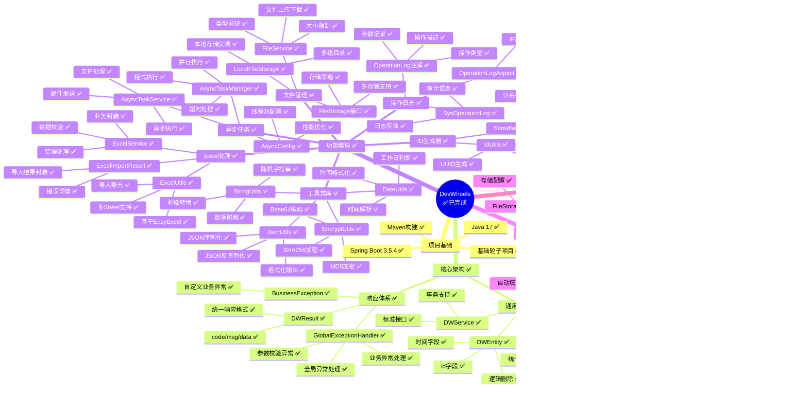

# DevWheels 架构思维导图

## ✅ 已完成功能 (Current Implementation)

## 🚀 规划扩展功能 (Planned Extensions)

## 架构层次说明

### 1. 架构分层
- **表现层**: Controller (统一REST API)
- **业务层**: Service (业务逻辑处理)
- **数据层**: Mapper (数据访问)
- **实体层**: Entity (数据模型)

### 2. 横切关注点
- **异常处理**: 全局统一异常处理
- **操作日志**: AOP切面自动记录
- **事务管理**: 声明式事务支持
- **参数校验**: JSR303自动校验

### 3. 核心特性
- **统一标准**: 统一的开发规范和代码风格
- **高度复用**: 通用基础类和工具类
- **企业级**: 完整的企业应用基础设施
- **可扩展**: 模块化设计，易于扩展新功能

### 4. 质量保证
- **完整测试**: 17个测试类，158个测试用例
- **代码规范**: 统一的命名和注释规范
- **异常处理**: 完善的异常处理机制
- **文档齐全**: 详细的功能说明和API文档